### Hi folks! 👋 I am Halit Vural.
<table align="right"><tr> 
    <td>
    </td>
    <td>
    </td>
    <td>
    </td></tr>
</table>

I’m currently working on bringing humanity new ideas
- 🌱 when trying how I can be more and more productive.
- - 👯 I’m looking to collaborate on Machine Learning tasks
- - - 🤔 I’m looking for help with understanding scientific data
- - - - 💬 Ask me about how I ruined the things with the Algorithms
- - - - - 📫 You can reach me out by clicking the links above ☝️
- - - - 🎨 I am good at talking about art and artistic work,
- - - 🏛️  history, events, and culture, human behaviours,
- - ❤️‍🩹 health, sports, hobbies, child education and..
- 🐈 and cats.They are adorable, cute and friendly.

## My Github Stats

 

 

 

<!--
**halit-vural/halit-vural** is a ✨ _special_ ✨ repository because its `README.md` (this file) appears on your GitHub profile.

Here are some ideas to get you started:

- 🔭 I’m currently working on ...
- 🌱 I’m currently learning ...
- 👯 I’m looking to collaborate on ...
- 🤔 I’m looking for help with ...
- 💬 Ask me about ...
- 📫 How to reach me: ...
- 😄 Pronouns: ...
- ⚡ Fun fact: ...
-->
